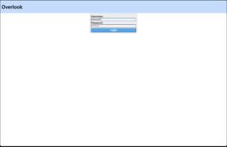
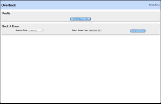

# Refactor Tractor - FitLit

## Contributors

* Matt McVey

## Overview
For this project, I was tasked with creating a booking application for a fake website. The point of the project was to display login page on load. Once logged in with appropriate credentials the user profile would display. The user displayed was based on the credntials. All information was gathered from APIs. The data was then filterd to show rooms booked and the amount the user had spent total on bookings. The user also has the ability to book new rooms based on search criteria which is then posted to the booking API.

## Outcome
I have created a fully responsive app that has solid lighthouse ratings. The site data is be pulled and displayed on the DOM as needed. The user is able to make new bookings which are being add to the API and filtered out later.

Login:  

Profile view and booking:  

## Future Iterations
* Incorporate the use of inheritance to have a manager class and login
* Add card flip animation and further styling
* Update total spent real time as currently it is only working on page load
* Incorporate more partial files with my index in order to clean up and slim the file down a bit
* Show more room details on booked cards

## Tech Stack
* Languages
  * Vanilla JS
  * HTML
  * CSS & SASS
* Web browser engine & compiler
  * Webpack
* Testing suite
  * Mocha
  * Chai

## Installation and Setup
1. Clone down this repo.
2. Install dependencies in the root directory with `npm install`
3. Clone the backend api at https://github.com/turingschool-examples/overlook-api
4. Start up the backend with `npm install` then `npm start`
5. Start the client with `npm start` in the root project directory
6. Go to http://localhost:8080/ to see the app.
